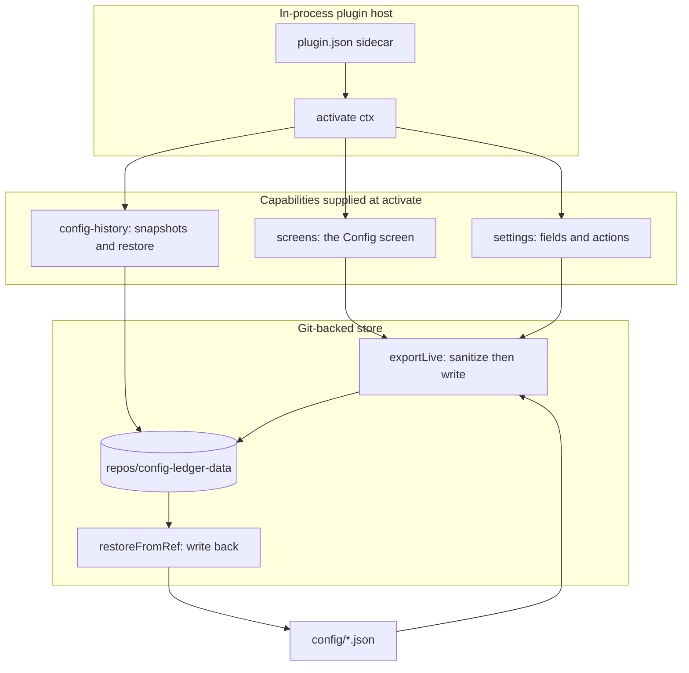

# config-ledger

[](https://www.npmjs.com/package/config-ledger)
[](https://www.npmjs.com/package/config-ledger)
[](https://github.com/intisy-ai/config-ledger/actions)

Git-backed config management for the loader ecosystem: versioned, sanitized snapshots of an app home's config with history, rollback, and profiles.

## Under-the-Hood Architecture



## Structure

- `src/`
  - TypeScript source: the git-backed ledger, the capability implementations (`capabilities.ts`), the api plugin (`plugin.ts`), and the slash-command CLI
  - `plugin.json`: the manifest an in-process host reads before importing this bundle
  - `core/` git submodule ([`intisy-ai/core`](https://github.com/intisy-ai/core)): shared config, logging, app detection, and the settings-capability adapter, bundled into `dist/` by esbuild
- `dist/`
  - `dist/index.js` (the hook entry and the module an in-process host imports; not committed)
  - `dist/lib.js` (the library surface other tools import; not committed)

## Installation

### Via plugin-updater (recommended)

```bash
npx plugin-updater@latest init https://github.com/intisy-ai/config-ledger
```

### Via npm

```bash
npm install config-ledger
```

## Configuration

Config file: `<configDir>/config/config-ledger.json` (edit via the loader or `/config-ledger-config set`).

```json
{
  "secrets": "exclude",
  "logging": true
}
```

| Key | Default |
| --- | --- |
| `secrets` | `"exclude"` |
| `logging` | `true` |

## Commands

| Command | Description | Arguments |
| --- | --- | --- |
| `/config-ledger-config` | View and change config-ledger configuration | `list | get <key> | set <key> <value>` |
| `/config-ledger` | Git-backed config: status/commit/push/pull/history/profile/setup |  |

## Dependencies

- `core`

## Logging

Logs are written to `<configDir>/logs/YYYY-MM-DD/config-ledger-HH-MM-SS.log` and are toggled by
this plugin's `logging` config (default on). Console mirroring is global, off by default,
and controlled by the shared `config/settings.json` `logConsole` flag.

## License

MIT.
